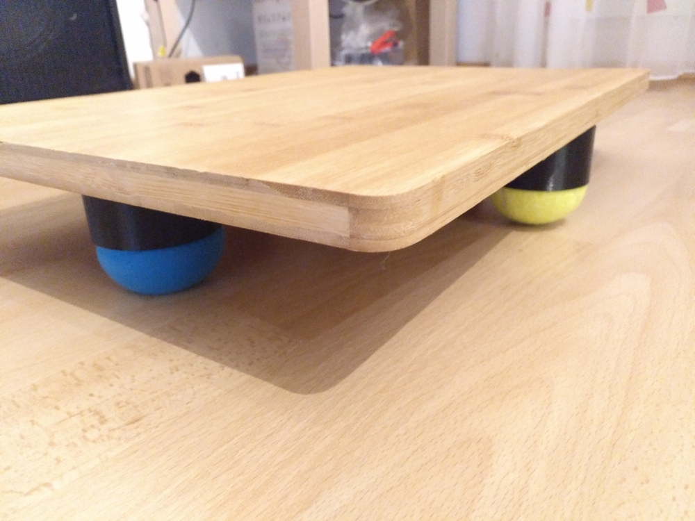

# DIY Office Balance Board

This is a balance board for standing desks. This helps to keep moving a little bit while standing and working.

The only thing needed are 3 or 5 cups. If you want to balance completely free, the 2 outer cups can be removed. For the center cups I've taken tennis balls, which are stable. The outer cups should be soft (I used softballs) to stabilize the board but still allow swinging.

BOM:
  - M4x20 screws
  - M4 washers
  - board (nice size is 50x30)
  - screw inserts (use whatever you like to assemble the cups)
  - printed cups
  - 3 tennis balls (depending how much cups are used on center line)
  - 2 softballs 

scad File is available for customization.

# LICENSE

 Dieses Werk ist lizenziert unter einer <a rel="license" href="http://creativecommons.org/licenses/by-sa/4.0/">Creative Commons Namensnennung - Weitergabe unter gleichen Bedingungen 4.0 International Lizenz</a>.

 This work is licensed under a <a rel="license" href="http://creativecommons.org/licenses/by-sa/4.0/">Creative Commons Attribution-ShareAlike 4.0 International License</a>.
